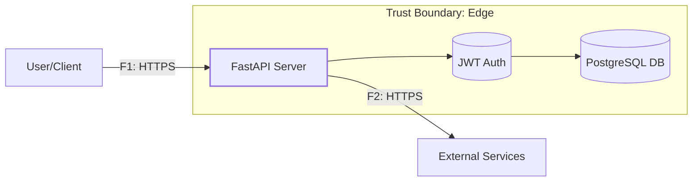

# DFD — Data Flow Diagram

## Контекстная диаграмма (Уровень 0)


## Детальная диаграмма (Уровень 1)
```mermaid
flowchart LR
  CLIENT[User/Client] -->|F1: POST /auth/login| AUTH_SVC[Auth Service]
  CLIENT -->|F2: GET /wishes| WISH_SVC[Wish Service]
  CLIENT -->|F3: POST /wishes| WISH_SVC
  CLIENT -->|F4: PATCH /wishes/{id}| WISH_SVC
  CLIENT -->|F5: DELETE /wishes/{id}| WISH_SVC

  subgraph Edge[Trust Boundary: Edge]
    AUTH_SVC -->|F6: Validate| JWT_MGR[JWT Manager]
    WISH_SVC -->|F7: Query/Update| DB[(Database)]
  end

  subgraph Core[Trust Boundary: Core]
    DB
  end

  style AUTH_SVC stroke-width:2px
  style WISH_SVC stroke-width:2px
```

## Список потоков
| ID | Откуда → Куда | Канал/Протокол | Данные/PII | Комментарий |
|----|---------------|-----------------|------------|-------------|
| F1 | Client → Auth Service | HTTPS POST | username, password | Аутентификация пользователя |
| F2 | Client → Wish Service | HTTPS GET | user_id (from JWT) | Получение списка желаний |
| F3 | Client → Wish Service | HTTPS POST | title, description, user_id | Создание нового желания |
| F4 | Client → Wish Service | HTTPS PATCH | title, description, wish_id | Обновление желания |
| F5 | Client → Wish Service | HTTPS DELETE | wish_id | Удаление желания |
| F6 | Auth Service → JWT Manager | Internal | user claims | Валидация и генерация токенов |
| F7 | Wish Service → Database | SQL | PII: wishes, user data | Хранение пользовательских данных |

## Границы доверия (Trust Boundaries)
1. **Edge (Край)**: Внешний API, обработка HTTP запросов, аутентификация
2. **Core (Ядро)**: База данных с чувствительными данными пользователей
